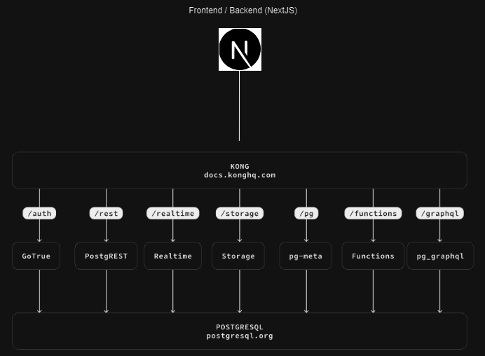

# TASKY

## Description

This is a simple task manager that allows you to add, delete, and edit tasks.

## Installation

1. Clone the repository
2. Rename (and modify) the .env.example files to your needs [see .env.example](./.env.example)
   and [see Docker .env.example](./docker/.env.example)
3. Run `cd docker` and `docker compose up -d` to start the project
4. Open `http://localhost:3000`
5. Enjoy!

## Structure

## Features

- Project Creation and Management: ✅
- Task Creation and Assignment: ✅
- Task Overview: ✅
- User Authentication: ✅
- User Roles and Permissions: (✅)
- Notification System: ❌
- Comments and File Attachments: ❌

## TODO

- Updating after action is delayed, you sometimes have to refresh the page to see the changes
- Toast notifications on actions
- You can assign a task to a user that's already assigned without "obvious" error (doesn't get assigned but no error)
- You can assign a task to a non-existing user without "obvious" error (doesn't get assigned but no error)
- Search doesn't work for now
- Owner of a task is not displayed as assignee until assigned (it's possible to assign yourself to a task you own)
- Roles and permissions aren’t fully implemented, e.g., you can assign a task to a user that’s not in the project
- Users can't delete/change their own account
